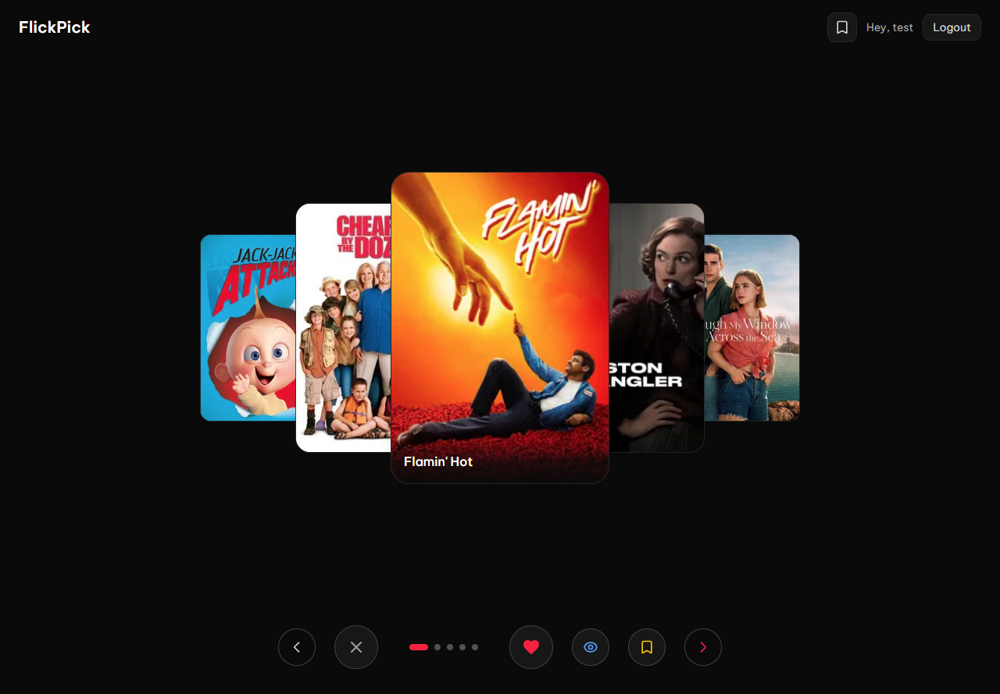

<div align="center">
  

  <br />
  <br />

  <h1>🎬 FlickPick</h1>
  <p><strong>Your Personalized Movie Discovery Companion</strong></p>
  <p>
    An intelligent, real-time movie recommendation engine powered by content-based machine learning.<br>
    Experience instant, personalized suggestions based on your unique taste profile.
  </p>

  <div align="center">
    <!-- Tech Stack Badges -->
    
    
    
    
    <br/>
    
    
    
  </div>
</div>

---

## 📖 Overview

**FlickPick** is not just another movie app—it's a sophisticated recommendation system designed for speed and accuracy. By leveraging **Sentence Transformers** and **cosine similarity**, FlickPick analyzes movie descriptions and genres to find hidden gems that match your preferences perfectly.

The system learns from your ratings in **real-time**. Every like, dislike, or star rating instantly refines your profile, ensuring that your next recommendation is better than the last.

## ✨ Key Features

- **🔮 Smart Recommendations**: Advanced content-based filtering that understands the _nuance_ of movies, not just the genre.
- **⚡ Instant Feedback Loop**: No waiting for nightly batch jobs. Rate a movie, and your feed updates immediately.
- **🎨 Modern Data-Rich UI**: Built with **Next.js 15** and **Tailwind CSS 4**, featuring a beautiful dark-themed interface with smooth animations (Framer Motion).
- **📋 Watchlist Management**: Keep track of what you want to see next.
- **🔍 Deep Search**: Find movies by title, genre, or keywords.

## 🛠️ Technology Stack

### Frontend

- **Framework**: [Next.js 15](https://nextjs.org/) (App Directory)
- **Language**: [TypeScript](https://www.typescriptlang.org/)
- **Styling**: [Tailwind CSS 4](https://tailwindcss.com/)
- **Animations**: [Framer Motion](https://www.framer.com/motion/)
- **Data Fetching**: [Axios](https://axios-http.com/)

### Backend

- **API**: [FastAPI](https://fastapi.tiangolo.com/) (High performance Python 3.10+ framework)
- **Database**: [MySQL](https://www.mysql.com/) with SQLAlchemy ORM
- **Machine Learning**: [Sentence Transformers](https://www.sbert.net/) (`all-MiniLM-L6-v2`) for vector embeddings.

## � Dataset

This project utilizes the [TMDB 930k Movie Dataset](https://www.kaggle.com/datasets/asaniczka/tmdb-movies-dataset-2023-930k-movies) from Kaggle for comprehensive movie metadata and descriptions.

## �🚀 Getting Started

### Prerequisites

- Node.js (v18+)
- Python (3.10+)
- MySQL Server

### Installation Setup

1. **Clone the Repository**

   ```bash
   git clone https://github.com/yourusername/flickpick.git
   cd flickpick
   ```

2. **Backend Setup**

   ```bash
   cd backend
   python -m venv .venv
   # Windows
   .venv\Scripts\activate
   # Mac/Linux
   # source .venv/bin/activate
   pip install -r requirements.txt
   ```

   _Note: Ensure your MySQL server is running and `database.py` is configured correctly._

   Start the API server:

   ```bash
   fastapi dev main.py
   ```

3. **Frontend Setup**

   ```bash
   cd frontend/flickpick
   pnpm install
   pnpm dev
   ```

4. **Experience It**
   Open [http://localhost:3000](http://localhost:3000) in your browser.

## 🤝 Contributing

Contributions are welcome! Please feel free to submit a Pull Request.

---

<div align="center">
  <p>Generated by <strong>KavinMK05</strong></p>
</div>
